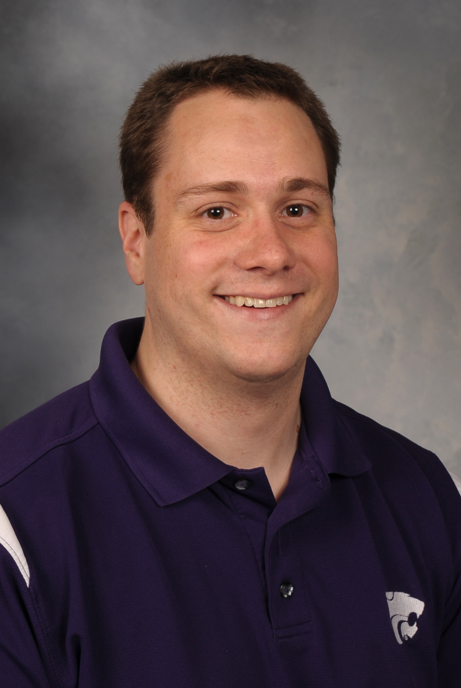

```{r setup, include=FALSE}
knitr::opts_chunk$set(echo = FALSE)
```


{width=35% }


## Professional
I am a machine learning engineer at Centene. I am also an adjunct professor at Kansas State University. I have 7 years of combined experience in data analytics, software engineering, and research.


## Domain Expertise

  * Applied Data Analytics
  * Machine Learning Engineering
  * Research and Development


## Technical Proficiencies

  * **Workbench**
    - Visual Studio Code
    - RStudio IDE
    - JupyterHub/Jupyter Notebooks
    - Gitlab/Github
    - WSL2/Ubuntu
    
  * **Languages**
    - R: renv, tidyverse, distill, ggplot2, rmarkdown, and shiny
    - Python: venv, pandas, numpy, scikit-learn
    - SQL: Teradata, Oracle
    - Mongo: Studio 3T
